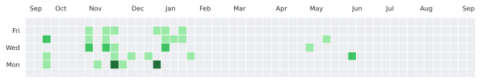

# Hi, I'm Ryan Colley 👋

This profile README updates automatically to showcase my recent personal GitHub activity 
> Private/internal work is included as anonymised counts only...Sadly my organisation activies are not permitted to be scraped

<!--CONTRIB_SUMMARY_START-->
### Contributions summary (2025-03-18 → 2026-03-18)
- Total contributions: **126**
- Commits: **27**, Issues: **0**, PRs: **1**, Reviews: **0**
- Repositories contributed to: **1**

#### Activity overview
- 💻 Commits: **96%**
- 🔀 Pull requests: **4%**
- 👁️ Code review: **0%**
- 🐛 Issues: **0%**

- 🔒 Includes anonymized private/internal activity: **97** (since 2025-04-25)

#### Top commit repos
- **ryancolley/ryancolley**: 27

#### Top PR repos
- **ryancolley/ryancolley**: 1

#### Top issue repos
_No data_

#### Top reviewed repos
_No data_

<picture>
  <source media="(prefers-color-scheme: dark)" srcset="assets/contributions_heatmap_dark.svg">
  <source media="(prefers-color-scheme: light)" srcset="assets/contributions_heatmap_light.svg">
  
</picture>
<!--CONTRIB_SUMMARY_END-->

